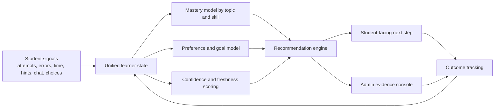

# Personalization Refinement Review

## Goal

Make personalization in the SQL chatbot materially more precise, more believable, and more useful to both students and admins.

The current system already has the right broad ingredients:

- student profiles
- conversation summaries
- issue detection
- recommendation generation
- quiz generation
- admin monitoring

But today it still behaves more like a coarse risk-labeling system than a truly personalized learning system.

## High-Level Assessment

From a product and UX perspective, the personalization stack currently has five major weaknesses:

1. Signal integrity is not reliable enough yet.
2. The learner model is too coarse and threshold-based.
3. Most personalization is hidden in backend logic or admin screens instead of being felt by the student.
4. The system collects almost no explicit student intent, goals, or preference corrections.
5. There is almost no validation loop to prove whether a personalization decision helped.

## Critical Evidence From Current Code

- `app/api/admin/students/calculate-profiles/route.ts` mixes `ObjectId`, string ids, and email identifiers in one flow. It reads using `user._id.toString()` but updates using raw `user._id`, while profile creation stores `userId` as string. This likely makes recalculation partially or fully ineffective.
- `lib/activity-tracker.ts` builds `$inc` and `$addToSet` style updates, then writes them through `$set`. That means activity-based profile updates are structurally wrong and can silently corrupt metrics instead of incrementing them.
- `lib/student-preferences.ts` supports only four preference keys. That is too narrow for real tutoring personalization.
- `lib/personalization.ts` relies heavily on keyword inference, simple thresholds, and a small static topic map. This is useful as a fallback, but not sufficient as the main personalization engine.
- `lib/personalization.ts` generates “personalized” quizzes from static topic templates instead of grounding them in the student’s exact misconception, current dataset, and course progression.
- `app/components/admin/StudentProfiles.tsx` gives admins labels and counters, but not enough evidence, confidence, traceability, or controls to refine personalization quality.
- `__tests__/homework/runner-personalization.test.tsx` explicitly verifies that the runner does not show personalization UI. That means the student-facing experience currently does not expose the system’s best personalization outputs.
- `app/components/student/ImprovementDashboard.tsx` and `app/components/student/AIAnalysisFeedback.tsx` exist but are not mounted anywhere, so student-facing improvement feedback is currently orphaned.

## Why Precision Is Weak Today

Using a scientific critical-thinking lens, the current system has four validity problems:

- Construct validity problem: `knowledgeScore` compresses a multidimensional learner into one bucket.
- Measurement bias problem: several signals are inferred from rough proxies like message count, keyword matches, or severity counts instead of validated mastery evidence.
- Identity confounding problem: different services alternate between email, string id, and `ObjectId`.
- Feedback-loop problem: the system records states, but barely measures whether a recommendation changed student outcomes.

## Target Personalization Architecture

## Prioritized Task List

## P0: Fix Data Integrity Before Tuning Personalization

### [x] Task 1: Normalize learner identity across all personalization systems

Problem:
The codebase uses `studentId`, `userId`, email, and `ObjectId` interchangeably. This is the biggest blocker to trustworthy personalization.

Do:

- Define one canonical learner key for all analytics and personalization writes. Recommendation: use the internal user id string everywhere, and keep email as an attribute only.
- Add a resolver layer that converts email or `ObjectId` input into the canonical string id at boundaries only.
- Migrate `student_profiles`, `student_preferences`, `student_activities`, analysis records, quiz results, and personalization analytics to the same identifier.
- Add defensive logging for identifier mismatches.

Files to start with:

- `app/api/admin/students/calculate-profiles/route.ts`
- `lib/student-profiles.ts`
- `lib/personalization.ts`
- `lib/ai-analysis-engine.ts`
- `lib/request-auth.ts`
- `lib/users.ts`

Acceptance:

- A profile recalculation updates the same student document every time.
- Personalization bundle, admin view, AI analysis, quizzes, and auth all resolve the same learner.

Status:

- Done on 2026-04-01.
- Implemented a canonical learner-id resolver, normalization at personalization/auth boundaries, and legacy-id migration for `student_profiles`, `student_preferences`, `student_activities`, `analysis_results`, `learning_quiz_results`, and personalization analytics actor ids.

### [x] Task 2: Repair activity tracking updates

Problem:
`lib/activity-tracker.ts` currently writes increment-like objects inside `$set`, which makes the stored metrics unreliable.

Do:

- Replace the current update builder with real Mongo update operators: `$inc`, `$set`, `$addToSet`, `$max`, and `$push` where appropriate.
- Add regression tests for chat, homework, practice, and help-request activity writes.
- Backfill or repair corrupted profile metric fields if any bad objects were already written.

Files to start with:

- `lib/activity-tracker.ts`
- `lib/data-collection-hooks.ts`
- related tests under `__tests__/`

Acceptance:

- Repeated activities produce monotonic metric growth.
- No profile field stores operator objects as actual values.

Status:

- Done on 2026-04-01.
- Replaced malformed `$set` payloads with real Mongo operators, added repair logic for corrupted metric fields, and added regression tests covering chat, homework, practice, and help-request writes.

### [x] Task 3: Repair profile recalculation logic

Problem:
The recalculation route is conceptually useful, but the current implementation is brittle and likely inconsistent because it mixes identifiers and uses very rough derived values.

Do:

- Fix the id mismatch in recalculation.
- Remove fake derived metrics such as `correctAnswers: Math.round(totalQuestions * 0.8)`.
- Split recalculation into:
  1. raw signal aggregation
  2. learner-state derivation
  3. profile snapshot persistence
- Store the source evidence and timestamp for every derived field.

Files to start with:

- `app/api/admin/students/calculate-profiles/route.ts`
- `lib/student-profiles.ts`

Acceptance:

- Admin recalculation produces reproducible snapshots.
- Every major profile field can be traced back to source evidence.

Status:

- Done on 2026-04-01.
- Rebuilt recalculation into explicit raw aggregation, learner-state derivation, and profile snapshot persistence with evidence metadata and timestamped source traces for major derived fields.

## P1: Replace Coarse Buckets With a Real Learner Model

### Task 4: Evolve from one `knowledgeScore` into topic mastery + confidence

Problem:
A single four-level score is too blunt for tutoring decisions.

Do:

- Keep `knowledgeScore` only as a summary label for dashboards.
- Introduce per-topic mastery records, for example:
  - topic
  - estimated mastery 0-1
  - confidence 0-1
  - evidence count
  - last evidence time
  - trend
  - strongest error types
- Expand beyond the current topic set so the model matches the actual SQL curriculum.
- Weight recent evidence more heavily than old evidence.

Suggested model areas:

- selection and projection
- filtering
- sorting
- joins
- grouping and aggregation
- subqueries
- set operations
- null handling
- schema comprehension
- debugging
- relational algebra
- exam-speed fluency

Files to start with:

- `lib/student-profiles.ts`
- `lib/personalization.ts`
- `lib/ai-analysis-engine.ts`

Acceptance:

- Two students can share the same high-level bucket but still receive different next steps based on topic mastery.
- Recommendations explain which evidence drove the recommendation.

Status:

- Done on 2026-04-01.
- Added a topic-level learner model with mastery, confidence, evidence counts, freshness-aware weighting, trends, and strongest error types; kept `knowledgeScore` as a summary label while recommendations now rank by topic mastery evidence.

### Task 5: Expand the preference model from 4 keys into a real tutoring profile

Problem:
Current preferences are too narrow and mostly passive.

Do:

- Add structured preference and intent fields such as:
  - preferred language
  - explanation style
  - example density
  - step-by-step tolerance
  - confidence level
  - pace preference
  - desired challenge level
  - exam focus vs homework completion
  - preferred hint style
  - preferred correction style
  - self-reported weak topics
  - accessibility needs
- Separate stable preferences from temporary session goals.
- Let students edit these values explicitly.
- Store confidence and source for each preference.

Files to start with:

- `lib/student-preferences.ts`
- `lib/openai/tools.ts`
- student onboarding and settings surfaces

Acceptance:

- The assistant can adapt tone, depth, pacing, and hint format based on stored student choices.
- Students can correct the system when it personalizes badly.

Status:

- Done on 2026-04-01.
- Expanded the preference schema with stable preferences plus session goals, added confidence/scope metadata, widened the tutoring tool schema, exposed authenticated student preference APIs, and mounted a student-editable tutoring-preferences card in the homework entry flow.

### Task 6: Replace keyword-only topic inference with evidence fusion

Problem:
Current topic/weakness inference is largely based on keyword matching and severity thresholds.

Do:

- Fuse multiple evidence sources per topic:
  - rubric misses
  - SQL execution failure types
  - retry loops
  - hint timing
  - time-to-first-success
  - chat intent patterns
  - AI analysis topic mapping
  - quiz outcomes
- Distinguish concept weakness from speed weakness, confidence weakness, and schema-reading weakness.
- Add freshness decay and source reliability weights.
- Track “unknown / insufficient evidence” explicitly instead of guessing.

Files to start with:

- `lib/personalization.ts`
- `lib/ai-analysis.ts`
- `lib/ai-analysis-engine.ts`
- submission and analytics models

Acceptance:

- Weakness detection is no longer dependent on text keywords alone.
- The system can say “low confidence” when evidence is weak.

Status:

- Done on 2026-04-01.
- Replaced the old keyword-only topic model with evidence fusion across submissions, analytics, hint timing, retries, quiz outcomes, AI analysis, and self-reported weaknesses, including reliability/freshness decay and explicit insufficient-evidence handling.

## P1: Make Recommendations Actually Personalized

### Task 7: Ground recommendations in the exact misconception, not only the topic

Problem:
The current recommendation engine can say “review JOIN logic,” but it does not model why the student failed joins.

Do:

- Add misconception categories such as:
  - wrong join predicate
  - missing join condition
  - grouping before filtering
  - aggregate without grouping
  - alias confusion
  - null misunderstanding
  - output-column mismatch
  - schema navigation failure
- Use these categories in recommendations, hints, and quizzes.
- Generate rationale in student language, not only admin language.

Files to start with:

- `lib/personalization.ts`
- `lib/ai-analysis.ts`
- `lib/comment-bank.ts`

Acceptance:

- Recommendation copy references the actual error pattern, not only the broad topic.

Status:

- Done on 2026-04-01.
- Added a shared misconception taxonomy, propagated exact misconception signals from failed attempts into recommendations, normalized comment categories to the same vocabulary, and changed recommendation copy to explain the concrete SQL mistake in student-facing language.

### Task 8: Replace static “personalized quiz” templates with grounded remediation

Problem:
The current quiz generation is topic-based but mostly static. It does not feel personal enough.

Do:

- Generate quiz items from:
  - the exact failed question structure
  - the same dataset or a minimally varied sibling dataset
  - the same misconception with slightly reduced complexity
  - one transfer question to test real learning
- Sequence quiz questions as:
  1. diagnose
  2. repair
  3. transfer
  4. confidence-check
- Make the output depend on homework context, deadline pressure, and student preference.

Files to start with:

- `lib/personalization.ts`
- `app/api/homework/[setId]/personalization/route.ts`
- quiz generation services

Acceptance:

- Personalized quizzes differ meaningfully across students with different error histories.
- Quiz questions reference the student’s real failure context.

Status:

- Done on 2026-04-01.
- Replaced the old topic-template quiz flow with a grounded diagnose/repair/transfer/confidence sequence that uses the student’s failed question context, detected misconception, current homework scope, deadline pressure, and study preferences.

### Task 9: Reintroduce a student-facing personalization surface

Problem:
Personalization exists in backend logic but the runner currently hides it.

Do:

- Add a student-facing “What Michael recommends next” card in the runner or study flow.
- Show:
  - one primary next step
  - why it is recommended
  - which skill is weak
  - estimated effort
  - expected payoff
- Add soft controls:
  - “This is helpful”
  - “Not relevant”
  - “Too easy”
  - “Too hard”
  - “Show me another path”
- Use the existing hidden/orphaned improvement surfaces as inspiration, but redesign them into a more focused, lower-friction experience.

Files to start with:

- `app/homework/runner/[setId]/RunnerClient.tsx`
- `app/homework/services/personalizationService.ts`
- `app/components/student/ImprovementDashboard.tsx`
- `app/components/student/AIAnalysisFeedback.tsx`
- `__tests__/homework/runner-personalization.test.tsx`

Acceptance:

- Students can see and respond to personalization in context.
- Acceptance and dismissal events are tracked.

Status:

- Done on 2026-04-01.
- Added an in-runner “What Michael recommends next” card with weak-skill, rationale, effort, payoff, misconception copy, soft feedback controls, alternate-path cycling, and analytics tracking for shown, acceptance, and dismissal-style feedback events.

## P2: Improve Admin Precision and Oversight

### [x] Task 10: Turn the admin profile screen into an evidence console, not a label table

Problem:
The current admin table shows buckets, counts, and generic metrics, but not enough evidence to refine personalization quality.

Do:

- Add an expandable student evidence drawer with:
  - top weak skills with confidence
  - recent failed attempts
  - hint usage patterns
  - chat-derived misconceptions
  - recent recommendation history
  - whether those recommendations helped
- Add admin actions:
  - confirm weakness
  - dismiss false positive
  - set temporary intervention
  - mark student goal
  - force recalibration
- Replace “issue count” as the dominant signal with a clearer pedagogical summary.

Files to start with:

- `app/components/admin/StudentProfiles.tsx`
- `app/api/admin/students/[studentId]/route.ts`
- supporting admin APIs

Acceptance:

- An admin can answer “why is this student marked as struggling?” from one screen.
- Admin corrections feed back into the learner model.

Status:

- Done on 2026-04-01.
- Replaced the old admin label table with an evidence console drawer that surfaces weak-skill evidence, failed attempts, hint patterns, chat-derived misconceptions, recommendation history, issue traceability, and admin actions for confirming or dismissing signals, setting interventions and goals, and forcing recalibration.

### [x] Task 11: Add confidence, freshness, and traceability to every personalization output

Problem:
The current system often presents outputs as facts, even when evidence is thin.

Do:

- Add confidence and freshness metadata to:
  - student profile fields
  - recommendations
  - issue detections
  - mastery signals
- Show “last updated from” and “based on” evidence in admin UI.
- Down-rank stale or low-confidence recommendations.

Files to start with:

- `lib/personalization.ts`
- `lib/student-profiles.ts`
- admin components

Acceptance:

- Low-confidence signals are visibly different from strong ones.
- Admins can distinguish between stale and current learner state.

Status:

- Done on 2026-04-01.
- Added shared confidence and freshness metadata for profile evidence, topic mastery, recommendations, and issue detections; exposed “based on” traceability in the admin console; and down-ranked stale or low-confidence recommendations before ranking them.

## P2: Capture Real Student Intent Earlier

### Task 12: Add a calibration + goals step after login and before homework start

Problem:
The entry flow currently gets the student into the homework, but captures almost nothing about current intent.

Do:

- Add a lightweight optional calibration panel in `StudentEntryClient`:
  - “What do you want help with today?”
  - “How confident do you feel?”
  - “Do you want concise hints or detailed steps?”
  - “Are you preparing for homework completion or exam practice?”
- Store answers as session goals plus durable preferences when appropriate.
- Keep it fast and skippable.

Files to start with:

- `app/homework/StudentEntryClient.tsx`
- `lib/student-preferences.ts`

Acceptance:

- The system has explicit session intent before making recommendations.

## P3: Add Closed-Loop Measurement

### Task 13: Measure whether personalization helped

Problem:
The platform can store recommendations, but it does not yet prove outcome improvement.

Do:

- Track for every recommendation:
  - shown
  - accepted
  - ignored
  - dismissed as irrelevant
  - completed
  - led to improved next attempt
- Compare outcome deltas:
  - score lift
  - time-to-success
  - attempt reduction
  - hint reduction
  - student confidence shift
- Store per-recommendation-type win rates.

Files to start with:

- `app/api/homework/[setId]/personalization/analytics/route.ts`
- `app/homework/services/personalizationService.ts`
- recommendation UI

Acceptance:

- The team can answer which personalization interventions actually work.

### Task 14: Run offline evaluation on historical student data

Problem:
Before tuning prompts or heuristics, the team needs a repeatable evaluation set.

Do:

- Create an offline evaluation harness with historical attempts and outcomes.
- Score personalization quality on:
  - topic identification accuracy
  - misconception accuracy
  - recommendation usefulness
  - false-positive rate
  - calibration quality
- Use expert-labeled samples from instructors for benchmark comparison.

Files to start with:

- `scripts/`
- `__tests__/lib/personalization.test.ts`
- analysis exports

Acceptance:

- Changes to personalization logic can be evaluated before rollout.

## UX Design Direction

If this system is upgraded, the personalization UI should feel editorial and instructional, not like generic SaaS analytics.

Recommendation:

- student view: calm, focused, lightweight, confidence-building
- admin view: dense evidence, strong hierarchy, fast scanability
- avoid: generic “AI insight cards” and vague motivational text
- emphasize: one clear next step, one explicit reason, one visible confidence level

## Suggested Delivery Order

### Phase 1

- Task 1
- Task 2
- Task 3

### Phase 2

- Task 4
- Task 5
- Task 6

### Phase 3

- Task 7
- Task 8
- Task 9

### Phase 4

- Task 10
- Task 11
- Task 12
- Task 13
- Task 14

## Short Conclusion

The system should not be treated as “missing personalization.” It already has a lot of scaffolding.

The real problem is that the current scaffolding is:

- partially inconsistent at the data layer
- too heuristic at the learner-model layer
- too hidden at the student experience layer
- too weak at the validation layer

If the team fixes those four things in order, personalization can move from “interesting internal logic” to something that students actually experience as accurate, helpful, and personal.
